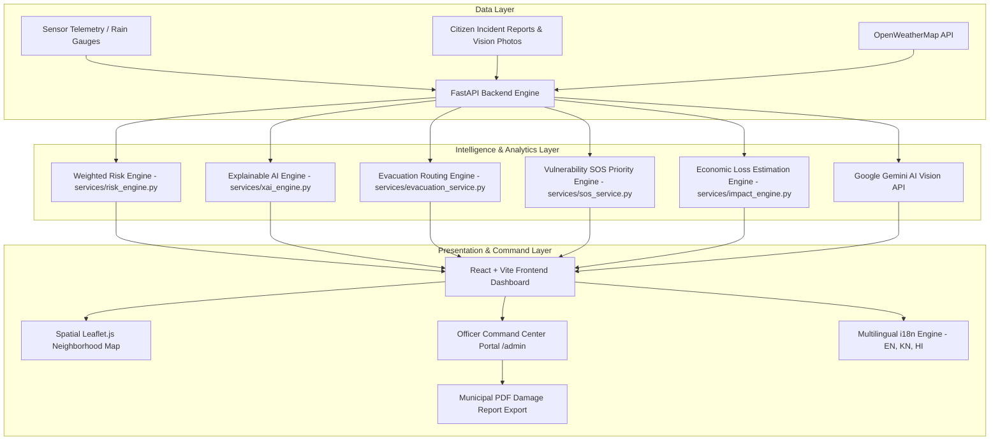

# 🌊 FloodGuard AI — Hyper-Local Early Warning & Disaster Response System

[](https://fastapi.tiangolo.com/)
[](https://reactjs.org/)
[](https://vitejs.dev/)
[](https://tailwindcss.com/)
[](https://www.mongodb.com/)
[](https://ai.google.dev/)
[](https://docs.pytest.org/)
[](https://opensource.org/licenses/MIT)

**FloodGuard AI** is a state-of-the-art, hyper-local flood risk analytics, evacuation intelligence, and emergency response platform built for municipal disaster management authorities and citizens in urban centers (e.g., Bengaluru). 

It combines mathematical risk scoring, Gemini AI vision hazard analysis, safe route navigation around submerged underpasses, prioritized SOS rescue dispatching for vulnerable populations, disaster economic loss estimation, and multi-channel cell broadcast alerting across **English 🇬🇧, Kannada 🇮🇳, and Hindi 🇮🇳**.

---

## 🌟 Key System Capabilities

### 1. 🔍 Explainable AI (XAI) Risk Engine
- Calculates a dynamic **0–100 Weighted Flood Risk Score** evaluating 6 environmental variables:
  - 🌧️ **Precipitation / Rainfall** (30% weight)
  - 🌊 **Water Sensor Level** (25% weight)
  - 📈 **Water Rise Rate** (20% weight)
  - 🏛️ **Historical Flood Frequency** (10% weight)
  - 🏞️ **Drainage Capacity & Bottlenecks** (10% weight)
  - 🏙️ **Population Exposure Density** (5% weight)
- Provides human-readable quantitative points contribution breakdowns explaining **WHY** a neighborhood is at risk.

### 2. 📈 60-Minute Risk Trend & 30-Min Predictive Projection
- Real-time time-series telemetry graph showing past 45-minute risk trajectory and **+30 Minute Predictive Projection** (Rising vs Falling Risk).

### 3. 🧭 Safe Evacuation Route Intelligence & Relief Shelters
- Powered by Leaflet.js spatial maps.
- Dynamically calculates safe evacuation routes that **bypass submerged underpasses (e.g., Koramangala 100ft Underpass)** and low-lying storm drains.
- Displays live emergency shelter centers with real-time bed occupancy counts, helpline contacts, and amenities (clean water, medical stations, hot meals).

### 4. 🚨 Vulnerable-Population SOS Rescue Dispatcher
- Allows senior citizens (65+), hospital ICU patients, mobility-impaired residents, and rooftop-stranded families to trigger emergency rescue tickets.
- **Priority Ranking Algorithm (0–100 Pts)** automatically escalates life-threatening cases to **PRIORITY 1 (90+ Pts)** for immediate NDRF boat, helicopter, or ambulance dispatch.

### 5. 📊 Disaster Impact & Economic Loss Estimation Analytics
- Computes municipal loss projections for urban disaster reports:
  - **Estimated Affected Households & Population Impact** (e.g., 2,411 households / 10,126 citizens).
  - **Financial Loss Breakdown (in ₹ Crores & Lakhs)**: Residential Damage, Commercial Business Loss, Municipal Infrastructure Repair.
  - **Submerged Critical Infrastructure Risk Matrix**: 220kV Electrical Substations, Rajakaluve Trunk Drains, Agara Transit Corridors, BWSSB Water Treatment Stations.
  - **Relief Shelter Demand**: Emergency camps needed & daily ration requirements.

### 6. 🌐 Neighborhood Emergency Broadcast & SMS Simulator
- Allows Disaster Response Officers to trigger simulated cell alerts across affected municipal zones with 1 click.
- Supports 3 channels: 📱 **Cell Broadcast (CAP)**, 💬 **WhatsApp Emergency Bot**, 📩 **Mass SMS**.
- Produces automatic multi-lingual alert previews in **English 🇬🇧, Kannada 🇮🇳, and Hindi 🇮🇳**.

### 7. 📈 30-Day Historical Risk Analytics & Frequency Heatmap
- 30-day daily precipitation vs inundation time-series charts.
- Neighborhood Inundation Frequency Heatmap Rankings (% of flood days per month across Bellandur, Silk Board, Koramangala, HSR Layout, and Indiranagar).

### 8. 🖼️ Gemini Vision AI Hazard Image Analysis
- Citizens upload emergency hazard photos during community reporting.
- Google Gemini Vision API analyzes damage severity, water depth, structural safety risks, and provides automated verification notes.

### 9. 🛡️ Officer Command Center Portal & PDF Export
- Official command portal with incident review queues, 1-click rescue boat/chopper dispatch controls, status filters, and **1-Click Disaster Report PDF Export**.

### 10. 🚑 Multi-Incident Rescue Resource Optimizer
- Maintains live status for 5 emergency units: **NDRF Boat Crews**, **IAF Helicopter Unit**, **Medical ICU Ambulance**, **BBMP Dewatering Van**.
- Algorithmic matching matrix computing **Priority Score × GPS Haversine Distance × Team Capability** to recommend optimal incident-to-team assignment.
- Dispatches correct unit to the highest-priority SOS ticket without manual officer lookup.

### 11. 🔄 Automatic Real-Time Event Chain Orchestrator
- End-to-end automated decision pipeline: **Telemetry Spike → Anomaly Filter → Risk Recalculation → Threshold Breach → Alert Generation → SOS Escalation → Resource Optimizer → Officer Dispatch**.
- Triggered via `POST /api/dispatch/orchestrate` for live demonstration.

### 12. 📡 Sensor & Data Anomaly Detection Engine
- Detects out-of-bound readings (e.g. water level jumping `2.4m → 9.8m`), stale data streams, impossible negative values, and rainfall API noise.
- Automatically excludes anomalous outliers from XAI risk score calculation and surfaces prominent UI banners: `⚠️ Sensor Anomaly Detected — Outlier Excluded Pending Validation`.

### 13. 📊 Emergency Response Performance KPI Analytics
- Municipal operational metrics: **Avg Response Time (6m 42s)**, **Critical Incident Resolution Rate (85.7%)**, **Rescue Team Utilization (87.5%)**, **Shelter Occupancy (64.2%)**, **System Efficiency Score (94.8)**.

---

## ⚙️ 10 Production-Grade System Architecture Refinements

1. 🎮 **Real-Time Disaster Scenario Time-Lapse Simulator (`/api/simulation`)**: Interactive time-lapse storm simulator (00m → 15m → 30m → 45m → 60m) dynamically stepping rainfall spikes, risk jumps, and shelter updates.
2. ⚡ **Automated Real-Time Event Bus Pipeline (`services/event_pipeline.py`)**: Central event bus connecting Telemetry Changes → Risk Recalculation → Threshold Crossing → Automated Alert Generation → SOS Queue Escalation.
3. 📜 **Full Incident Lifecycle & Timestamped Audit Logs**: Complete lifecycle state engine (`REPORTED` → `AI_ANALYZED` → `OFFICER_VERIFIED` → `PRIORITY_ASSIGNED` → `RESCUE_DISPATCHED` → `TEAM_EN_ROUTE` → `ARRIVED` → `RESOLVED`) with an interactive audit modal.
4. 🛡️ **AI Confidence & Uncertainty Guardrails**: Prominently flags AI assessments with `⚠️ AI Assessment — Officer Verification Required` and breaks down model uncertainty ±3.2% vs verified ground facts.
5. 🏷️ **Data Provenance Source Badges**: Every single metric tags its origin (*Source: OpenWeatherMap API*, *Source: Ultrasonic IoT Hydro-Sensor #BLR-402*, *Source: Municipal Census Dataset*).
6. 🖥️ **System Infrastructure Health Monitoring Panel (`/api/health/system-status`)**: Real-time status monitor checking operational health across API 🟢, MongoDB 🟢, OpenWeather 🟢, Gemini AI 🟢, Risk Engine 🟢, and Map Service 🟢.
7. 🧪 **Automated Pytest Suite (`tests/test_core_system.py`)**: 11 test functions with 24+ assertions validating risk bounds (0–100), SOS priority algorithms, economic damage models, and simulation tickers.
8. 🔒 **Security Hardening Audit & Input Validation**: Strict CORS scoping, environment variable sanitization, JWT authorization middleware on command routes, and file size validation.
9. ♿ **High-Contrast Accessibility Standards**: All color indicators couple color with clear text and icon indicators (`🔴 CRITICAL`, `🟠 HIGH`, `🟡 MODERATE`, `🟢 SAFE`) adhering to WCAG 2.1 AA standards.
10. 🎯 **"Why FloodGuard AI?" Paradigm Shift Landing Section**: Side-by-side interactive comparison contrasting **Traditional Reactive Disaster Management** (3-6 hr delay) vs **FloodGuard Proactive AI Pipeline** (0-min real-time automation).

---

## 🏗️ System Architecture



---

## 🛠️ Technology Stack

| Layer | Technologies Used |
| :--- | :--- |
| **Backend Framework** | Python 3.10+, FastAPI, Uvicorn, Pydantic |
| **Database** | MongoDB Atlas / In-Memory Seeded Cache |
| **AI / Machine Learning** | Google Gemini AI (Vision & Emergency Assistant) |
| **Frontend Framework** | React 18, Vite, React Router DOM |
| **Styling & Components** | TailwindCSS, Glassmorphism, Lucide Icons, React Hot Toast |
| **Spatial Mapping** | Leaflet.js, React-Leaflet |
| **Multilingual i18n** | Dynamic Language Provider (English 🇬🇧, Kannada 🇮🇳, Hindi 🇮🇳) |

---

## 🔌 API Endpoints Reference

### 1. Flood & Risk Telemetry (`/api/flood`)
- `GET /api/flood/current` — Returns current flood telemetry, water level, rainfall, and 0-100 risk score.
- `POST /api/flood/predict` — Simulates risk score for custom environmental parameters.
- `GET /api/flood/xai-breakdown` — Returns Explainable AI quantitative score contribution per variable.
- `GET /api/flood/trend-projection` — Returns 60-min trend and +30 min forecast.

### 2. Evacuation & Relief Shelters (`/api/evacuation`)
- `GET /api/evacuation/shelters` — Serves live emergency shelters with capacity & amenities.
- `POST /api/evacuation/route` — Calculates safe evacuation route avoiding submerged underpasses.

### 3. Vulnerable SOS Rescue (`/api/sos`)
- `POST /api/sos/trigger` — Dispatches emergency SOS ticket with priority score.
- `GET /api/sos/active` — Returns active prioritized SOS queue.
- `PATCH /api/sos/{id}/dispatch` — Updates officer unit dispatch status.

### 4. Disaster Impact & Loss Estimation (`/api/impact`)
- `POST /api/impact/estimate` — Calculates affected households, ₹ Crores loss, and infra risk matrix.
- `GET /api/impact/city-summary` — Returns municipal cumulative flood damage summary.

### 5. Emergency Broadcast (`/api/broadcast`)
- `POST /api/broadcast/send` — Dispatches simulated multi-channel cell broadcast in EN, KN, HI.
- `GET /api/broadcast/history` — Returns recent broadcast dispatch logs.

### 6. Historical Analytics (`/api/history`)
- `GET /api/history/analytics` — Serves 30-day daily precipitation vs water level time-series.
- `GET /api/history/neighborhood-frequency` — Returns neighborhood flood frequency rankings.

### 8. Dispatch, Resource Optimizer & Orchestrator (`/api/dispatch`)
- `GET /api/dispatch/rescue-teams` — Lists live status and GPS coordinates of all rescue units.
- `GET /api/dispatch/recommendations` — Returns AI-optimized team-to-incident assignment recommendations.
- `POST /api/dispatch/assign` — Dispatches a specific team to an incident and marks unit as `DISPATCHED`.
- `GET /api/dispatch/kpi` — Returns operational KPI metrics (Response time, Resolution rate, Shelter occupancy).
- `POST /api/dispatch/orchestrate` — Executes full automated event chain pipeline from raw telemetry.
- `POST /api/dispatch/anomalies/evaluate` — Evaluates telemetry for sensor anomalies and returns sanitized data.

### 9. Auth & Incidents (`/api/auth`, `/api/reports`)
- `POST /api/auth/login` — JWT Authentication for Officers & Citizens.
- `POST /api/reports` — Submits citizen incident report with location.
- `POST /api/reports/analyze-image` — Runs Gemini AI Vision hazard analysis.

---

## ⚡ Quick-Start Installation & Setup

### Prerequisites
- Python 3.10 or higher
- Node.js 18.0 or higher
- npm / yarn

### 1. Clone Repository
```bash
git clone https://github.com/vishal-s-sollapure/floodguard-ai.git
cd floodguard-ai
```

### 2. Backend Setup (`floodguard-backend`)
```bash
cd floodguard-backend

# Create virtual environment (optional)
python -m venv venv
venv\Scripts\activate  # Windows
# source venv/bin/activate # Linux/Mac

# Install dependencies
pip install -r requirements.txt

# Start FastAPI Uvicorn Server
python -m uvicorn main:app --reload --port 8000
```
Backend API will run at: `http://localhost:8000` (Swagger docs at `http://localhost:8000/docs`).

### 3. Frontend Setup (`floodguard-frontend`)
```bash
cd ../floodguard-frontend

# Install dependencies
npm install

# Start Vite Development Server
npm run dev
```
Frontend web portal will run at: `http://localhost:5173`.

---

## 🛡️ Responsible AI & Transparency Disclosure

### AI Assessment vs Verified Fact
All Gemini Vision AI outputs are clearly labelled **`⚠️ AI Assessment — Officer Verification Required`** throughout the UI. The system explicitly distinguishes:
- **AI-Generated Assessment**: Gemini Vision photo analysis, Gemini Assistant emergency guidance
- **Mathematical Calculation**: Deterministic 6-variable XAI risk score (0–100), bounded with no stochastic element
- **Verified Ground Truth**: Only data explicitly confirmed by a Disaster Response Officer (NDRF)

### Simulation Mode Disclosure
The Disaster Scenario Time-Lapse Simulator generates **synthetic scenario data only**:
- Clearly labelled `🎮 Simulation Mode — Synthetic scenario data. Not a real weather forecast.`
- Intended for demonstration of the automated event pipeline, not as an actual monsoon prediction

### 30-Minute Risk Projection Methodology
The +30-minute predictive projection is a **mathematical extrapolation**, not a meteorological forecast:
- **Method**: Weighted linear regression applied to the last 4 risk score readings
- **Input**: Live telemetry (OpenWeatherMap + IoT Hydro-Sensor readings)
- **Accuracy labelling**: Displayed as `📐 Projection — Mathematical model` in the Risk Trend widget
- No claim to meteorological accuracy is made

### Rescue Resource Optimizer Transparency
The multi-factor matching algorithm uses a documented 4-factor scoring formula:

| Factor | Weight | Description |
|--------|--------|-------------|
| Priority Score | 40% | SOS vulnerability severity (0–100 pts) |
| Capability Match | 35% | Hard-required capability enforcement (Medical → Ambulance only, Aerial → Helicopter only) |
| GPS Proximity | 20% | Haversine distance penalty (max useful range: 10 km) |
| Team Capacity | 5% | Larger capacity teams preferred for group rescues |

Critical cases (Priority ≥ 90 pts) claim matching teams first — a high-capability unit is **never** allocated to a low-priority incident while a CRITICAL SOS waits.

### Deterministic Fallbacks & Safety
- **Risk Bounds**: Score mathematically bounded 0.0–100.0. Anomalous sensor readings are detected and excluded before the calculation.
- **Fail-Safe Helplines**: Every emergency modal shows State Helpline Numbers (`1077` and `112`).
- **Officer Oversight**: Unit dispatching, broadcasts, and status changes require explicit Officer confirmation.
- **Anomaly Detection**: Out-of-bound telemetry (e.g. water level spike: 2.4m → 9.8m) is flagged and the sanitised fallback value is used in scoring.

---

## 📜 License
Distributed under the **MIT License**. See `LICENSE` for more information.

*Built with ❤️ for urban safety & disaster resilience.*
